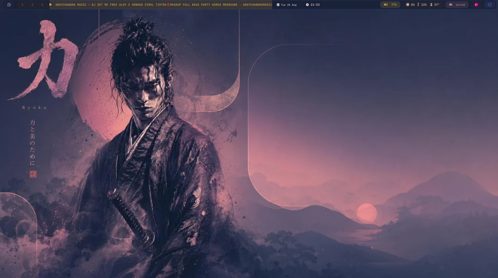
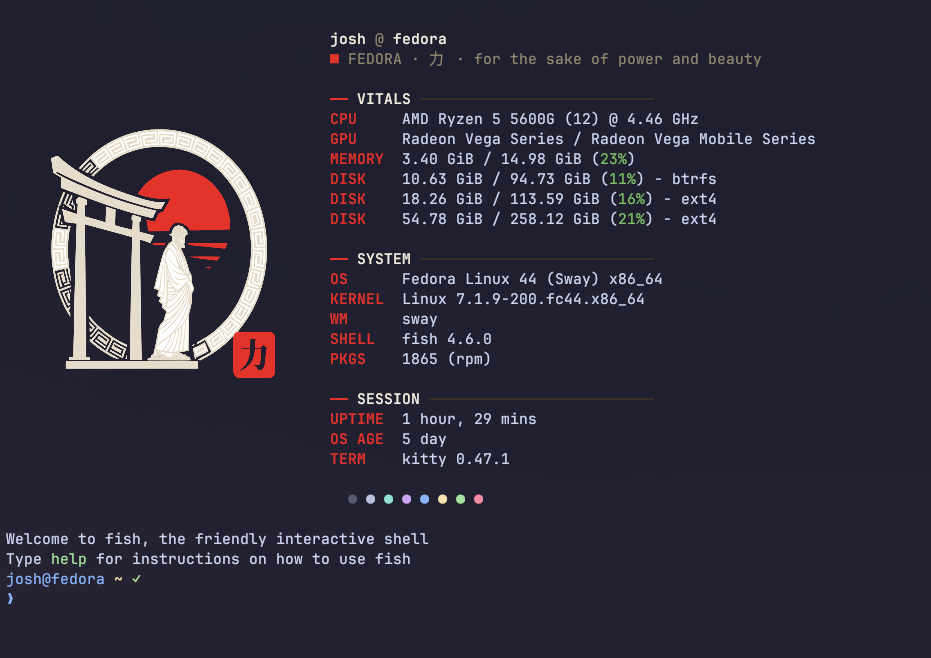

# Sway Ricing Dotfiles

Dotfiles for a **Fedora + Sway** desktop rice.



## Features

- **Sway** tiling WM with custom theme, autostart, and powermenu
- **Waybar** top bar with system stats (`btop`), network, pulseaudio, clock, tray
- **Fastfetch** startup summary with a custom logo and an "OS AGE" module
- **Kitty** terminal tuned for the rice

## Requirements

Install on Fedora:

```bash
sudo dnf install \
  sway waybar kitty fastfetch btop \
  pavucontrol playerctl wofi fuzzel \
  brightnessctl swaylock grim slurp wl-clipboard
```

Fonts:

```bash
sudo dnf install jetbrains-mono-fonts fontawesome-fonts
```

> The bar icons use *Font Awesome 6*; the terminal/UI uses *JetBrains Mono*.

## Install / Restore

Clone the repo and copy into `~/.config`:

```bash
git clone https://github.com/Coutons/sway-ricing.git
cp -r sway-ricing/.config/* ~/.config/
```

Or use [GNU stow](https://www.gnu.org/software/stow/):

```bash
git clone https://github.com/Coutons/sway-ricing.git ~/dotfiles
cd ~/dotfiles
stow -t ~ .config
```

After copying, restart the bar / session so the new config is picked up:

```bash
pkill -x waybar; waybar &
# for sway itself: log out and back in
```

## Keybindings

Window and launcher keybindings live in `.config/sway/config` (based on the
`$mod` = Super key). Open that file to review or remap them.

## Screenshot

The image at the top is `screenshot.png` in the repo root. To refresh it:

```bash
grim -g "$(slurp)" ~/dotfiles/screenshot.png
cd ~/dotfiles && git add screenshot.png && git commit -m "docs: update screenshot"
```

## Fastfetch



## Notes

These are pure **dotfiles**. Some things are system-level and are **not**
included, since they depend on the OS version at reinstall time:

- `/etc/default/grub` and the output of `grub2-mkconfig`
- release identity (`fedora-release-*`) — the i3 → sway swap is done via `dnf`
- boot entries in `/boot/loader/entries/*.conf` (auto-generated)

If you want an identical result after a fresh install, set up those system
parts manually.
